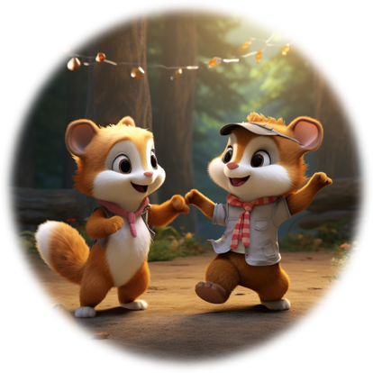

  

<h2 align="center">💃DreamWaltz: Make a Scene with Complex 3D Animatable Avatars</h2>

## Introduction
DreamWaltz focuses on text-driven 3D animatable avatar creation using pretrained 2D diffusion model <b>ControlNet</b> and human parametric model <b>SMPL</b>.
